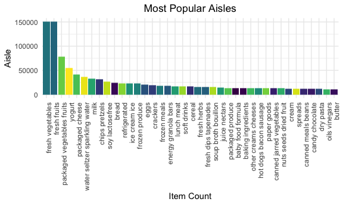

P8105 HW3 jl6046
================
Brian Jo Hsuan Lee
2021-10-18

Import packages

``` r
library(tidyverse)
library(httr)
library(jsonlite)
library(patchwork)
library(p8105.datasets)
```

Set knitr options

``` r
knitr::opts_chunk$set(
  fig.width = 6,
  fig.asp = .6,
  out.width = "90%"
)

theme_set(theme_minimal() + theme(legend.position = "bottom"))

options(
  ggplot2.continuous.colour = "viridis",
  ggplot2.continuous.fill = "viridis"
)

scale_colour_discrete = scale_colour_viridis_d
scale_fill_discrete = scale_fill_viridis_d
```

\#\#Problem 1: Instacart Purchases

The instacart dataset shows purchase records labeled with buyers, time,
and other relevant identifiers, such as aisle and department. It has
1384617 observations and 15 variables, with a purchased item on each
row. For example, we could see that a customer bought a Bulgarian yogurt
from the yogurt aisle in the dairy department and a Cucumber Kirby from
the fresh vegetables aisle in the produce department on the same day.

``` r
data("instacart")
str(instacart)
```

    ## tibble [1,384,617 × 15] (S3: tbl_df/tbl/data.frame)
    ##  $ order_id              : int [1:1384617] 1 1 1 1 1 1 1 1 36 36 ...
    ##  $ product_id            : int [1:1384617] 49302 11109 10246 49683 43633 13176 47209 22035 39612 19660 ...
    ##  $ add_to_cart_order     : int [1:1384617] 1 2 3 4 5 6 7 8 1 2 ...
    ##  $ reordered             : int [1:1384617] 1 1 0 0 1 0 0 1 0 1 ...
    ##  $ user_id               : int [1:1384617] 112108 112108 112108 112108 112108 112108 112108 112108 79431 79431 ...
    ##  $ eval_set              : chr [1:1384617] "train" "train" "train" "train" ...
    ##  $ order_number          : int [1:1384617] 4 4 4 4 4 4 4 4 23 23 ...
    ##  $ order_dow             : int [1:1384617] 4 4 4 4 4 4 4 4 6 6 ...
    ##  $ order_hour_of_day     : int [1:1384617] 10 10 10 10 10 10 10 10 18 18 ...
    ##  $ days_since_prior_order: int [1:1384617] 9 9 9 9 9 9 9 9 30 30 ...
    ##  $ product_name          : chr [1:1384617] "Bulgarian Yogurt" "Organic 4% Milk Fat Whole Milk Cottage Cheese" "Organic Celery Hearts" "Cucumber Kirby" ...
    ##  $ aisle_id              : int [1:1384617] 120 108 83 83 95 24 24 21 2 115 ...
    ##  $ department_id         : int [1:1384617] 16 16 4 4 15 4 4 16 16 7 ...
    ##  $ aisle                 : chr [1:1384617] "yogurt" "other creams cheeses" "fresh vegetables" "fresh vegetables" ...
    ##  $ department            : chr [1:1384617] "dairy eggs" "dairy eggs" "produce" "produce" ...
    ##  - attr(*, "spec")=
    ##   .. cols(
    ##   ..   order_id = col_integer(),
    ##   ..   product_id = col_integer(),
    ##   ..   add_to_cart_order = col_integer(),
    ##   ..   reordered = col_integer(),
    ##   ..   user_id = col_integer(),
    ##   ..   eval_set = col_character(),
    ##   ..   order_number = col_integer(),
    ##   ..   order_dow = col_integer(),
    ##   ..   order_hour_of_day = col_integer(),
    ##   ..   days_since_prior_order = col_integer(),
    ##   ..   product_name = col_character(),
    ##   ..   aisle_id = col_integer(),
    ##   ..   department_id = col_integer(),
    ##   ..   aisle = col_character(),
    ##   ..   department = col_character()
    ##   .. )

There are 134 distinct aisles in the data set.

``` r
aisle_count = 
  instacart %>% 
  select(aisle) %>% 
  distinct()

aisle_count
```

    ## # A tibble: 134 × 1
    ##    aisle                        
    ##    <chr>                        
    ##  1 yogurt                       
    ##  2 other creams cheeses         
    ##  3 fresh vegetables             
    ##  4 canned meat seafood          
    ##  5 fresh fruits                 
    ##  6 packaged cheese              
    ##  7 specialty cheeses            
    ##  8 water seltzer sparkling water
    ##  9 cream                        
    ## 10 packaged vegetables fruits   
    ## # … with 124 more rows

And among them, the ‘fresh vegetables’, ‘fresh fruits’, and ‘packaged
vegetables fruits’ were the most popular aisles from which items were
bought.

``` r
aisle_pop = 
  instacart %>% 
  mutate(count = 1) %>% 
  aggregate(count ~ aisle, data = ., sum) %>% 
  arrange(desc(count))

head(aisle_pop, 5)
```

    ##                        aisle  count
    ## 1           fresh vegetables 150609
    ## 2               fresh fruits 150473
    ## 3 packaged vegetables fruits  78493
    ## 4                     yogurt  55240
    ## 5            packaged cheese  41699

With fresh vegetables and fresh fruits surpassing 150 thousand
purchases, see the other 47 popular aisles with over 10 thousand
purchases.

``` r
aisle_pop %>% 
  filter(count > 10000) %>% 
  mutate(
    aisle_ord = factor(aisle),
    aisle_ord = forcats::fct_reorder(aisle_ord, count, .desc = TRUE)
  ) %>% 
  ggplot(., aes(x = aisle_ord, y = count, fill = aisle)) +
  geom_bar(stat="identity") +
  labs(
    title = "Most Popular Aisles",
    x = "Item Count",
    y = "Aisle"
  ) +
  theme(
    plot.title = element_text(hjust = 0.5),
    axis.text.x = element_text(hjust = 1, angle = 90),
    legend.position = "none",
    legend.title = element_blank(),
    legend.key.size = unit(0.5, 'cm'),
    legend.text = element_text(size = 5)
  )
```



The following table shows the number of purchases for each of the 3 most
popular items from aisles “baking ingredients”, “dog food care”, and
“pacakged vegetables”.

``` r
bi_pop =
  instacart %>%
  select(aisle, product_name) %>% 
  filter(aisle == "baking ingredients") %>%
  group_by(aisle, product_name) %>% 
  summarize(count = n()) %>% 
  arrange(desc(count)) %>% 
  slice(1:3) %>% 
  ungroup()

dfc_pop =
  instacart %>%
  select(aisle, product_name) %>% 
  filter(aisle == "dog food care") %>%
  group_by(aisle, product_name) %>% 
  summarize(count = n()) %>% 
  arrange(desc(count)) %>% 
  slice(1:3) %>% 
  ungroup()

pvf_pop =
  instacart %>%
  select(aisle, product_name) %>% 
  filter(aisle == "packaged vegetables fruits") %>%
  group_by(aisle, product_name) %>% 
  summarize(count = n()) %>% 
  arrange(desc(count)) %>% 
  slice(1:3) %>% 
  ungroup()

item_pop = 
  bind_rows(bi_pop, dfc_pop, pvf_pop)

item_pop
```

    ## # A tibble: 9 × 3
    ##   aisle                      product_name                                  count
    ##   <chr>                      <chr>                                         <int>
    ## 1 baking ingredients         Light Brown Sugar                               499
    ## 2 baking ingredients         Pure Baking Soda                                387
    ## 3 baking ingredients         Cane Sugar                                      336
    ## 4 dog food care              Snack Sticks Chicken & Rice Recipe Dog Treats    30
    ## 5 dog food care              Organix Chicken & Brown Rice Recipe              28
    ## 6 dog food care              Small Dog Biscuits                               26
    ## 7 packaged vegetables fruits Organic Baby Spinach                           9784
    ## 8 packaged vegetables fruits Organic Raspberries                            5546
    ## 9 packaged vegetables fruits Organic Blueberries                            4966

The following is a table showing the mean hour of the day at which Pink
Lady Apples and Coffee Ice Cream are ordered on each day of the week.

``` r
aic_week =
  instacart %>% 
  filter(product_name == c("Pink Lady Apples", "Coffee Ice Cream")) %>% 
  select(order_dow, order_hour_of_day, product_name) %>% 
  mutate(
    order_dow = recode(order_dow, `0` = "sunday", `1` = "monday", `2` = "tuesday", `3` = "wednesday", `4` = "thursday", `5` = "friday", `6` = "saturday")
  ) %>% 
  group_by(order_dow, product_name) %>% 
  summarize(mean_hour = mean(order_hour_of_day, )) %>% 
  mutate(
    mean_hour = round(mean_hour, 1)
  ) %>% 
  pivot_wider(
    names_from = order_dow,
    values_from = mean_hour
  ) %>% 
  select(product_name, sunday, monday, tuesday, wednesday, thursday, friday, saturday) %>% 
  ungroup()

aic_week
```

    ## # A tibble: 2 × 8
    ##   product_name     sunday monday tuesday wednesday thursday friday saturday
    ##   <chr>             <dbl>  <dbl>   <dbl>     <dbl>    <dbl>  <dbl>    <dbl>
    ## 1 Coffee Ice Cream   13.2   15      15.3      15.4     15.2   10.3     12.4
    ## 2 Pink Lady Apples   12.2   11.7    12        13.9     11.9   13.9     11.6

## Problem 2: BRFSS

Load and clean up the BRFSS data set for this problem

``` r
data("brfss_smart2010")

brfss_df = 
  brfss_smart2010 %>% 
  janitor::clean_names() %>% 
  filter(topic == "Overall Health", response == c("Excellent", "Very Good", "Good", "Fair", "Poor")) %>% 
  mutate(
    response = factor(response, levels = c("Excellent", "Very Good", "Good", "Fair", "Poor"))
  )
```
