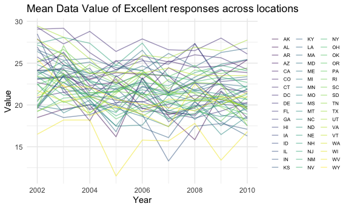
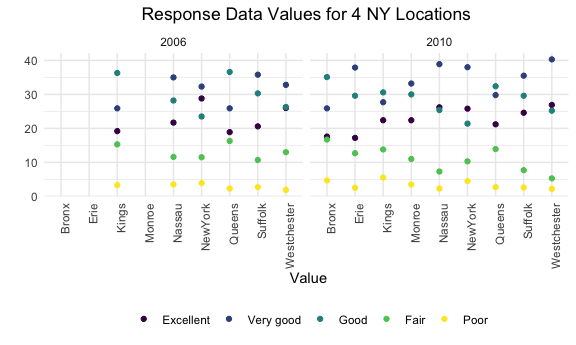
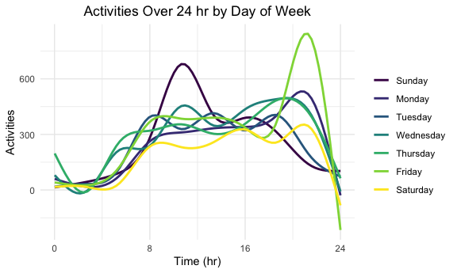

P8105 HW3 jl6046
================
Brian Jo Hsuan Lee
2021-10-18

Import packages

``` r
library(tidyverse)
library(p8105.datasets)
library(ggridges)
```

Set knitr options

``` r
knitr::opts_chunk$set(
  fig.width = 6,
  fig.asp = .6,
  out.width = "90%"
)

theme_set(theme_minimal() + theme(legend.position = "bottom"))

options(
  ggplot2.continuous.colour = "viridis",
  ggplot2.continuous.fill = "viridis"
)

scale_colour_discrete = scale_colour_viridis_d
scale_fill_discrete = scale_fill_viridis_d
```

\#\#Problem 1: Instacart Purchases

The instacart dataset shows purchase records labeled with buyers, time,
and other relevant identifiers, such as aisle and department. It has
1384617 observations and 15 variables, with a purchased item on each
row. For example, we could see that a customer bought a Bulgarian yogurt
from the yogurt aisle in the dairy department and a Cucumber Kirby from
the fresh vegetables aisle in the produce department on the same day.

``` r
data("instacart")
str(instacart)
```

    ## tibble [1,384,617 × 15] (S3: tbl_df/tbl/data.frame)
    ##  $ order_id              : int [1:1384617] 1 1 1 1 1 1 1 1 36 36 ...
    ##  $ product_id            : int [1:1384617] 49302 11109 10246 49683 43633 13176 47209 22035 39612 19660 ...
    ##  $ add_to_cart_order     : int [1:1384617] 1 2 3 4 5 6 7 8 1 2 ...
    ##  $ reordered             : int [1:1384617] 1 1 0 0 1 0 0 1 0 1 ...
    ##  $ user_id               : int [1:1384617] 112108 112108 112108 112108 112108 112108 112108 112108 79431 79431 ...
    ##  $ eval_set              : chr [1:1384617] "train" "train" "train" "train" ...
    ##  $ order_number          : int [1:1384617] 4 4 4 4 4 4 4 4 23 23 ...
    ##  $ order_dow             : int [1:1384617] 4 4 4 4 4 4 4 4 6 6 ...
    ##  $ order_hour_of_day     : int [1:1384617] 10 10 10 10 10 10 10 10 18 18 ...
    ##  $ days_since_prior_order: int [1:1384617] 9 9 9 9 9 9 9 9 30 30 ...
    ##  $ product_name          : chr [1:1384617] "Bulgarian Yogurt" "Organic 4% Milk Fat Whole Milk Cottage Cheese" "Organic Celery Hearts" "Cucumber Kirby" ...
    ##  $ aisle_id              : int [1:1384617] 120 108 83 83 95 24 24 21 2 115 ...
    ##  $ department_id         : int [1:1384617] 16 16 4 4 15 4 4 16 16 7 ...
    ##  $ aisle                 : chr [1:1384617] "yogurt" "other creams cheeses" "fresh vegetables" "fresh vegetables" ...
    ##  $ department            : chr [1:1384617] "dairy eggs" "dairy eggs" "produce" "produce" ...
    ##  - attr(*, "spec")=
    ##   .. cols(
    ##   ..   order_id = col_integer(),
    ##   ..   product_id = col_integer(),
    ##   ..   add_to_cart_order = col_integer(),
    ##   ..   reordered = col_integer(),
    ##   ..   user_id = col_integer(),
    ##   ..   eval_set = col_character(),
    ##   ..   order_number = col_integer(),
    ##   ..   order_dow = col_integer(),
    ##   ..   order_hour_of_day = col_integer(),
    ##   ..   days_since_prior_order = col_integer(),
    ##   ..   product_name = col_character(),
    ##   ..   aisle_id = col_integer(),
    ##   ..   department_id = col_integer(),
    ##   ..   aisle = col_character(),
    ##   ..   department = col_character()
    ##   .. )

There are 134 distinct aisles in the dataset.

``` r
aisle_count = 
  instacart %>% 
  select(aisle) %>% 
  distinct()

dim(aisle_count)
```

    ## [1] 134   1

And among them, the ‘fresh vegetables’, ‘fresh fruits’, and ‘packaged
vegetables fruits’ were the most popular aisles from which items were
bought.

``` r
aisle_pop = 
  instacart %>% 
  mutate(count = 1) %>% 
  aggregate(count ~ aisle, data = ., sum) %>% 
  arrange(desc(count))

head(aisle_pop, 5)
```

    ##                        aisle  count
    ## 1           fresh vegetables 150609
    ## 2               fresh fruits 150473
    ## 3 packaged vegetables fruits  78493
    ## 4                     yogurt  55240
    ## 5            packaged cheese  41699

With fresh vegetables and fresh fruits surpassing 150 thousand
purchases, see the other 47 popular aisles with over 10 thousand
purchases.

``` r
aisle_pop %>% 
  filter(count > 10000) %>% 
  mutate(
    aisle_ord = factor(aisle),
    aisle_ord = forcats::fct_reorder(aisle_ord, count, .desc = TRUE)
  ) %>% 
  ggplot(., aes(x = aisle_ord, y = count, fill = aisle)) +
  geom_bar(stat="identity") +
  labs(
    title = "Most Popular Aisles",
    x = "Item Count",
    y = "Aisle"
  ) +
  theme(
    plot.title = element_text(hjust = 0.5),
    axis.text.x = element_text(hjust = 1, angle = 90),
    legend.position = "none"
  )
```


The following table shows the number of purchases for each of the 3 most
popular items from aisles “baking ingredients”, “dog food care”, and
“packaged vegetables”.

``` r
bi_pop =
  instacart %>%
  select(aisle, product_name) %>% 
  filter(aisle == "baking ingredients") %>%
  group_by(aisle, product_name) %>% 
  summarize(count = n()) %>% 
  arrange(desc(count)) %>% 
  slice(1:3) %>% 
  ungroup()

dfc_pop =
  instacart %>%
  select(aisle, product_name) %>% 
  filter(aisle == "dog food care") %>%
  group_by(aisle, product_name) %>% 
  summarize(count = n()) %>% 
  arrange(desc(count)) %>% 
  slice(1:3) %>% 
  ungroup()

pvf_pop =
  instacart %>%
  select(aisle, product_name) %>% 
  filter(aisle == "packaged vegetables fruits") %>%
  group_by(aisle, product_name) %>% 
  summarize(count = n()) %>% 
  arrange(desc(count)) %>% 
  slice(1:3) %>% 
  ungroup()

item_pop = 
  bind_rows(bi_pop, dfc_pop, pvf_pop)

knitr::kable(item_pop,
             format = "simple", 
             col.names = str_to_title(names(item_pop))
)
```

| Aisle                      | Product\_name                                 | Count |
|:---------------------------|:----------------------------------------------|------:|
| baking ingredients         | Light Brown Sugar                             |   499 |
| baking ingredients         | Pure Baking Soda                              |   387 |
| baking ingredients         | Cane Sugar                                    |   336 |
| dog food care              | Snack Sticks Chicken & Rice Recipe Dog Treats |    30 |
| dog food care              | Organix Chicken & Brown Rice Recipe           |    28 |
| dog food care              | Small Dog Biscuits                            |    26 |
| packaged vegetables fruits | Organic Baby Spinach                          |  9784 |
| packaged vegetables fruits | Organic Raspberries                           |  5546 |
| packaged vegetables fruits | Organic Blueberries                           |  4966 |

The following is a table showing the mean hour of the day at which Pink
Lady Apples and Coffee Ice Cream are ordered on each day of the week.

``` r
aic_week =
  instacart %>% 
  filter(product_name %in% c("Pink Lady Apples", "Coffee Ice Cream")) %>% 
  select(order_dow, order_hour_of_day, product_name) %>% 
  mutate(
    order_dow = recode(order_dow, `0` = "sunday", `1` = "monday", `2` = "tuesday", `3` = "wednesday", `4` = "thursday", `5` = "friday", `6` = "saturday")
  ) %>% 
  group_by(order_dow, product_name) %>% 
  summarize(mean_hour = mean(order_hour_of_day, )) %>% 
  mutate(
    mean_hour = round(mean_hour, 1)
  ) %>% 
  pivot_wider(
    names_from = order_dow,
    values_from = mean_hour
  ) %>% 
  select(product_name, sunday, monday, tuesday, wednesday, thursday, friday, saturday) %>% 
  ungroup()

knitr::kable(aic_week,
             format = "simple", 
             col.names = str_to_title(names(aic_week))
)
```

| Product\_name    | Sunday | Monday | Tuesday | Wednesday | Thursday | Friday | Saturday |
|:-----------------|-------:|-------:|--------:|----------:|---------:|-------:|---------:|
| Coffee Ice Cream |   13.8 |   14.3 |    15.4 |      15.3 |     15.2 |   12.3 |     13.8 |
| Pink Lady Apples |   13.4 |   11.4 |    11.7 |      14.2 |     11.6 |   12.8 |     11.9 |

## Problem 2: BRFSS

Load and clean up the BRFSS dataset for this problem.

``` r
data("brfss_smart2010")

brfss_df = 
  brfss_smart2010 %>% 
  janitor::clean_names() %>% 
  filter(topic == "Overall Health", response %in% c("Excellent", "Very good", "Good", "Fair", "Poor")) %>% 
  mutate(
    response = factor(response, levels = c("Excellent", "Very good", "Good", "Fair", "Poor"))
  )
```

MA, NJ, PA had observations from more than 7 locations in 2002, and CA,
FL, MD, NC, NE, NY, OH, TX WA achieved it in 2010 as well in addition to
the 3 states in 2002 with the excpetion of PA.

``` r
more_than_7_df = 
  brfss_df %>% 
  filter(year %in% c(2002, 2010)) %>% 
  select(year, locationabbr, locationdesc) %>% 
  distinct() %>% 
  group_by(year, locationabbr) %>% 
  summarize(count = n()) %>% 
  ungroup() %>% 
  pivot_wider(
    names_from = year,
    values_from = count
  ) %>% 
  mutate(
    `>7_in_2002` = `2002` > 7,
    `>7_in_2010` = `2010` > 7
  ) %>% 
  select(locationabbr, `>7_in_2002`, `>7_in_2010`) %>% 
  filter(`>7_in_2002` == TRUE | `>7_in_2010` == TRUE) %>% 
  arrange(locationabbr)

more_than_7_df
```

    ## # A tibble: 12 × 3
    ##    locationabbr `>7_in_2002` `>7_in_2010`
    ##    <chr>        <lgl>        <lgl>       
    ##  1 CA           FALSE        TRUE        
    ##  2 FL           FALSE        TRUE        
    ##  3 MA           TRUE         TRUE        
    ##  4 MD           FALSE        TRUE        
    ##  5 NC           FALSE        TRUE        
    ##  6 NE           FALSE        TRUE        
    ##  7 NJ           TRUE         TRUE        
    ##  8 NY           FALSE        TRUE        
    ##  9 OH           FALSE        TRUE        
    ## 10 PA           TRUE         FALSE       
    ## 11 TX           FALSE        TRUE        
    ## 12 WA           FALSE        TRUE

Show the mean value of Excellent responses across locations within a
state by year as a spaghetti plot. This is not a really helpful plot to
be honest.

``` r
er_df = 
  brfss_df %>%
  filter(response == "Excellent") %>% 
  select(year, locationabbr, locationdesc, data_value) %>% 
  group_by(year, locationabbr) %>% 
  summarize(mean_value = mean(data_value, na.rm = TRUE)) %>% 
  ungroup()

ggplot(er_df, aes(x = year, y = mean_value, color = locationabbr)) +
  geom_line(alpha = 0.5) +
  labs(
    title = "Mean Data Value of Excellent responses across locations",
    x = "Year",
    y = "Value"
  ) + 
  theme(
    legend.title = element_blank(),
    legend.position = "right",
    legend.text = element_text(size = 6),
    legend.key.size = unit(0.35, 'cm')
  )
```



The following is a two-panel plot showing the distribution of data
values according to their responses in 4 NY locations in 2006 and 2010.

``` r
ny_df = 
  brfss_df %>% 
  filter(year %in% c(2006, 2010), locationabbr == "NY") %>% 
  mutate(
    locationdesc = replace(locationdesc, locationdesc == "NY - New York County", "NY - NewYork County")
  ) %>%
  separate(col = locationdesc, into = c('prefix', 'dash', 'county', 'suffix'), sep = ' ') %>%
  select(year, county, data_value, response)
  
ggplot(ny_df, aes(x = county, y = data_value, color = response)) +
  geom_point() +
  facet_grid(~year)+
  labs(
    title = "Response Data Values for 4 NY Locations",
    x = " Value",
    y = ""
  ) +
  theme(
    plot.title = element_text(hjust = 0.5),
    legend.title = element_blank(),
    axis.text.x = element_text(hjust = 1, angle = 90)
  )
```



\#\#Problem 3:

The tidied accelerometer dataset (35 x 1444) includes a patient’s motion
per minute record of the 1440 minutes in a day for 5 full weeks. The
additional 4 variables are a unique identifier for the 35 days
investigated, week number, day of the week, and whether the day is a
weekday or a weekend.

``` r
acc_df = 
  read_csv("./accel_data.csv") %>% 
  janitor::clean_names() %>% 
  mutate(
    day_or_end = day %in% c("Saturday", "Sunday"),
    day_or_end = replace(day_or_end, day_or_end == TRUE, "Weekend"),
    day_or_end = replace(day_or_end, day_or_end == FALSE, "Weekday"),
    day_or_end = factor(day_or_end),
    day = factor(day, levels = c("Sunday", "Monday", "Tuesday", "Wednesday", "Thursday", "Friday", "Saturday"))
  ) %>% 
  select(day_id, week, day, day_or_end, everything())

dim(acc_df)
```

    ## [1]   35 1444

Total daily activity shown in the table. Note the first column is
Friday, since the record begins on that day of week. Observations could
be made about the significantly lower activities on the 4th and 5th
Saturdays, and the lower variance on Tuesdays and Wednesdays.

``` r
tot_daily_acc =
  acc_df %>% 
  mutate(
    activity_total = rowSums(select(., starts_with("activity_"))),
    activity_total = round(activity_total, 0)
  ) %>% 
  select(week, day, activity_total) %>% 
  pivot_wider(
    names_from = day, 
    values_from = activity_total
  ) %>% 
  select(week, Friday, Saturday, Sunday, Monday, Tuesday, Wednesday, Thursday)
  
knitr::kable(tot_daily_acc,
             format = "simple", 
             col.names = str_to_title(names(tot_daily_acc)))
```

| Week | Friday | Saturday | Sunday | Monday | Tuesday | Wednesday | Thursday |
|-----:|-------:|---------:|-------:|-------:|--------:|----------:|---------:|
|    1 | 480543 |   376254 | 631105 |  78828 |  307094 |    340115 |   355924 |
|    2 | 568839 |   607175 | 422018 | 295431 |  423245 |    440962 |   474048 |
|    3 | 467420 |   382928 | 467052 | 685910 |  381507 |    468869 |   371230 |
|    4 | 154049 |     1440 | 260617 | 409450 |  319568 |    434460 |   340291 |
|    5 | 620860 |     1440 | 138421 | 389080 |  367824 |    445366 |   549658 |

Once the data is plotted and smooth curves are drawn, it is evident that
the patient was more active during Tuesday mornings and Friday evenings.
Note that these are approximates given the minute-by-minute record over
the course of 5 weeks, hence the below-0 estimates especially towards
the extremes, and all outliers are considered but not normalized.

``` r
long_acc_df =
  acc_df %>% 
  pivot_longer(
    cols = starts_with("activity_"),
    names_to = "minute",
    names_prefix = "activity_",
    values_to = "activities"
  ) %>% 
  mutate(
    minute = as.numeric(minute)
  )

long_acc_df %>% 
  ggplot(aes(x = minute, y = activities, color = day)) +
  geom_smooth(span = 0.3, se = FALSE) +
  labs(
    title = "Activities Over 24 hr by Day of Week",
    x = "Time (hr)",
    y = "Activities"
  )+
  theme(
    plot.title = element_text(hjust = 0.5),
    legend.title = element_blank(),
    legend.position = "right"
  ) +
  scale_x_continuous(
    limits = c(0, 1440),
    breaks = c(0, 8*60, 16*60, 24*60),
    labels = c(0, 8, 16, 24)
  )
```


